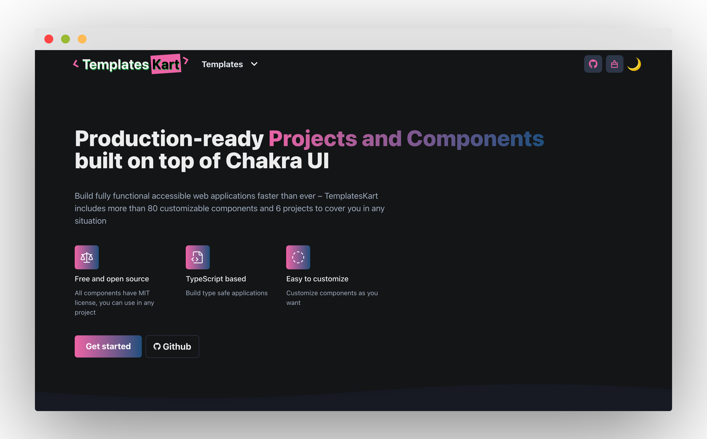

  <h2 align="center">TemplatesKart</h2>
  
  <strong>A powerful set of fully responsive and accessible ChakraUI React components and projects</strong>
  
  <strong>Official Website: https://templateskart.com</strong>

  

## Overview

### [Projects Kart](https://templateskart.com)

Projects kart provides an easy solution to getting the look you want for your website without having to mess around with too much code.
Explore projects and copy code of any section that you like.

### [Components Kart](https://templateskart.com/components)

Beautiful and responsive React components to build your application. Checkout components list. Copy and paste component code to your application and enjoy your free time 🎉

## Components

- [x] Blog
- [x] Cards
- [x] Features
- [x] Footers
- [x] Forms
- [x] Headers
- [x] Heroes
- [x] Milestones
- [x] Page Sections
- [x] Page shells
- [x] Pagination
- [x] Pricing
- [x] Reviews
- [x] Sidebars
- [x] Stacked lists
- [x] Stats
- [x] Testimonials

## Built with

- **Framework**: [Next.js](https://nextjs.org/)
- **Styling**: [Chakra UI](https://chakra-ui.com/)
- **Animations**: [Framer Motion](https://www.framer.com/motion/)

## Contributing

Contributions are what make the open source community such an amazing place to be learn, inspire, and create. Any contributions you make are greatly appreciated.

## License

See [LICENSE](LICENSE) for more information.
